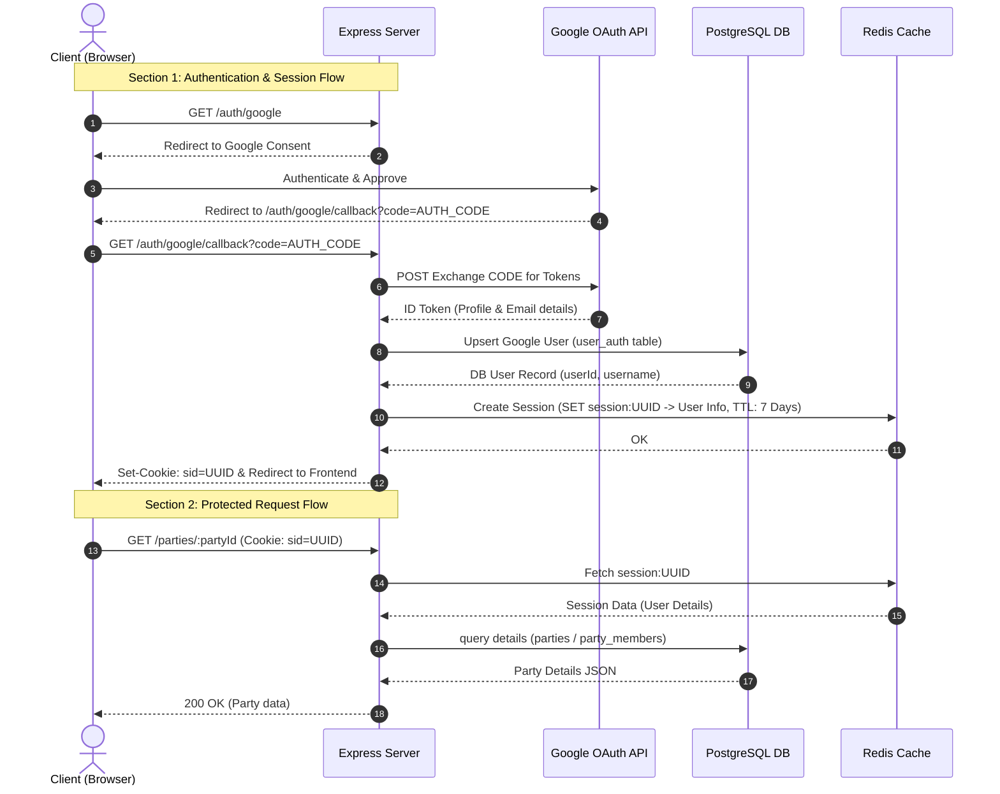

# 🧱 Checkmate Express Backend Architecture Guide

This document describes the step-by-step operation of the `checkmate-backend` Express application. It details how the components interact, the database structure, the algorithms used at each step, and the resulting inputs and outputs.

---

## 🏗️ System Overview & Flow Diagram

The backend acts as a REST API for authentication and party lobby management, persisting data using PostgreSQL and caching/session management via Redis.



---

## 🔑 1. Authentication & Session Management

### Step 1.1: Initiate Login (`GET /auth/google`)
*   **Triggers when:** A user clicks "Login with Google" on the client.
*   **Code Location:** [auth.routes.ts](file:///e:/ccs/checkmate-backend/express/src/routes/auth.routes.ts#L15-L25)
*   **Logic:**
    1.  Uses Google’s official `OAuth2Client` to call `generateAuthUrl()`.
    2.  Asks for scopes: `userinfo.profile` and `userinfo.email` with offline access and consent prompt.
*   **Result:** Redirects the user's browser to the Google OAuth consent page.

### Step 1.2: Handle OAuth Callback (`GET /auth/google/callback`)
*   **Triggers when:** Google redirects back to the backend with an authorization code.
*   **Code Location:** [auth.routes.ts](file:///e:/ccs/checkmate-backend/express/src/routes/auth.routes.ts#L28-L76)
*   **Logic:**
    1.  **Code Exchange:** Exchanges authorization code for access and identity tokens using `oAuth2Client.getToken(code)`.
    2.  **Verification:** Verifies the ID token cryptographically using `oAuth2Client.verifyIdToken()` against the client ID.
    3.  **Payload Extraction:** Extracts the user's Google ID (`sub`), `email`, and `name`.
    4.  **Database Upsert:** Calls `upsertGoogleUser()` in [user_auth.ts](file:///e:/ccs/checkmate-backend/shared/db/user_auth.ts#L18-L54):
        *   **Algorithm (Username Conflict Resolver):**
            1.  Splits the email at `@` to extract the `baseUsername`.
            2.  Attempts to insert a new record into `user_auth` with `lastLogin` set to `NOW()`.
            3.  If a unique constraint conflict occurs on `googleId`, it updates `lastLogin` and `email` on the existing row.
            4.  If a unique constraint conflict occurs on `username` (PostgreSQL error code `23505`), it appends a random four-digit suffix to the base username: `_` + `Math.floor(1000 + Math.random() * 9000)` and tries again.
    5.  **Session Creation:** Calls `SessionService.createSession()` in [session.service.ts](file:///e:/ccs/checkmate-backend/express/src/services/session.service.ts#L14-L20):
        *   **Algorithm (Token Generation):** Generates a random session ID using **UUIDv4** via `crypto.randomUUID()`.
        *   **Storage:** Saves the session details as a serialized JSON string in Redis under the key `session:${sessionId}`.
        *   **Expiration:** Sets a Time-To-Live (TTL) of **7 days** (`604,800` seconds).
    6.  **Set-Cookie:** Sets the `sid` cookie on the HTTP response:
        *   `httpOnly`: True (protects against XSS).
        *   `secure`: True in production (HTTPS only).
        *   `sameSite`: `lax` (prevents CSRF).
        *   `maxAge`: 7 days.
*   **Result:** Client is authenticated, cookie is saved, and browser redirects to `FRONTEND_URL` (default: `http://localhost:5173`).

### Step 1.3: User Logout (`POST /auth/logout`)
*   **Triggers when:** A user clicks "Logout".
*   **Code Location:** [auth.routes.ts](file:///e:/ccs/checkmate-backend/express/src/routes/auth.routes.ts#L79-L86)
*   **Logic:**
    1.  Extracts the `sid` cookie from the incoming request.
    2.  If present, executes `SessionService.destroySession(sessionId)` which runs `DEL` on `session:${sessionId}` in Redis.
    3.  Clears the `sid` cookie.
*   **Result:** Session is invalidated in Redis, cookie is cleared, and returns `{ ok: true, message: "Logged out successfully" }`.

---

## 🛡️ 2. Request Lifecycle & Middleware

Every request targeting a protected route passes through two critical middleware layers:

### Step 2.1: Authentication Middleware (`requireAuth`)
*   **Triggers when:** Any request is made to protected routes (`/parties/*` or `/me`).
*   **Code Location:** [auth.ts](file:///e:/ccs/checkmate-backend/express/src/middleware/auth.ts#L12-L32)
*   **Logic:**
    1.  Reads `req.cookies.sid`. If missing, aborts with **401 Unauthorized**.
    2.  Calls `SessionService.getSession(sessionId)`.
    3.  If Redis returns no data (session expired/deleted):
        *   Clears the cookie using `res.clearCookie("sid")`.
        *   Aborts with **401 Unauthorized** (Session invalid or expired).
    4.  If valid, stores session user object in `req.user` and calls `next()`.
*   **Result:** Binds authentication metadata to the request pipeline.

### Step 2.2: Rate Limiter Middleware (`createRateLimiter`)
*   **Triggers when:** Placed on endpoints (e.g., `/submit`).
*   **Code Location:** [rateLimiter.ts](file:///e:/ccs/checkmate-backend/express/src/middleware/rateLimiter.ts#L11-L56)
*   **Algorithm (Sliding Window Log via Redis Sorted Sets):**
    1.  **Identifier Selection:** Determines client identifier. Uses `req.user.userId` if authenticated; otherwise falls back to `req.ip`.
    2.  **Key Prefix:** `${keyPrefix}:${userId}`.
    3.  **Pipeline Clean & Count:**
        *   Executes `zremrangebyscore(key, 0, now - windowMs)` to purge timestamps older than the sliding window.
        *   Executes `zcard(key)` to get the count of requests made in the current window.
    4.  **Threshold check:**
        *   If `requestCount >= maxLimit`, sets headers `X-RateLimit-Limit`, `X-RateLimit-Remaining: 0`, and `Retry-After`. Returns **429 Too Many Requests**.
        *   If below limit, adds the request timestamp using `zadd(key, now, now.toString())` and extends key lifetime using `expire(key, windowMsSeconds)`. Calls `next()`.
    5.  **Fail Open Strategy:** If Redis fails, catches the error, logs it, and calls `next()` to avoid blocking clients.
*   **Result:** Protects endpoints from abuse using sliding windows.

---

## 🎮 3. Party & Lobby Management

All party endpoints are protected by `requireAuth` and route requests through [party.controller.ts](file:///e:/ccs/checkmate-backend/express/src/controllers/party.controller.ts) to [party.service.ts](file:///e:/ccs/checkmate-backend/express/src/services/party.service.ts).

### Step 3.1: Create Party (`POST /parties`)
*   **Body Schema:** `{ name: string, password?: string, maxPlayers?: number, leaderId: number }`
*   **Code Location:** [party.service.ts](file:///e:/ccs/checkmate-backend/express/src/services/party.service.ts#L33-L65)
*   **Logic:**
    1.  **Lobby ID Generation Algorithm:**
        *   Generates a random 3-byte sequence via `crypto.randomBytes(3)`.
        *   Converts it to uppercase hexadecimal, resulting in a **6-character short ID** (e.g., `A4D9F2`).
    2.  **Password Hashing Algorithm (if password provided):**
        *   **Salt Generation:** Generates a random 16-byte cryptographically secure salt: `crypto.randomBytes(16).toString("hex")` (32 hex characters).
        *   **Hashing:** Performs PBKDF2 hashing:
            ```typescript
            crypto.pbkdf2Sync(password, salt, 1000, 64, "sha512").toString("hex")
            ```
        *   **Formatting:** Stores the salt and derived key joined by a colon: `salt:hash` (totaling 161 characters).
    3.  **Database Transaction:** Invokes `dbCreateParty()` in [party.ts](file:///e:/ccs/checkmate-backend/shared/db/party.ts#L21-L52):
        *   Executes SQL commands inside a `BEGIN / COMMIT` transaction block.
        *   **Query 1:** Inserts party details into `parties` table.
        *   **Query 2:** Automatically inserts the leader into the `party_members` table.
        *   If any query fails, runs `ROLLBACK` to prevent partial creation.
*   **Result:** Returns the newly created party metadata (status code **201**).

### Step 3.2: Join Party (`POST /parties/join`)
*   **Body Schema:** `{ partyId: string, userId: number, password?: string }`
*   **Code Location:** [party.service.ts](file:///e:/ccs/checkmate-backend/express/src/services/party.service.ts#L67-L100)
*   **Logic:**
    1.  Fetches party details and current members.
    2.  Checks if the user is already a member (if so, returns early).
    3.  **Capacity Check:** Compares total active members against `maxPlayers`. If full, throws **400 Bad Request**.
    4.  **Password Verification Algorithm (if party is password-protected):**
        *   Splits the stored hash by `:` into `salt` and `expectedHash`.
        *   Computes the verification hash:
            ```typescript
            const verifyHash = crypto.pbkdf2Sync(password, salt, 1000, 64, "sha512").toString("hex");
            ```
        *   Verifies if `expectedHash === verifyHash`. If incorrect, throws **401 Unauthorized**.
    5.  **Add Member:** Inserts a row into `party_members` table using `dbAddMember()`.
*   **Result:** User is successfully registered in the lobby.

### Step 3.3: Leave Party (`POST /parties/leave/:partyId`)
*   **Body Schema:** `{ userId: number }`
*   **Code Location:** [party.service.ts](file:///e:/ccs/checkmate-backend/express/src/services/party.service.ts#L102-L130)
*   **Logic:**
    1.  Fetches party and current member records.
    2.  Deletes the matching row from the `party_members` table using `dbRemoveMember()`.
    3.  **Lobby State Evaluation:**
        *   **Case A (Empty Lobby):** If no members remain, deletes the lobby from `parties` table (`dbDeleteParty()`).
        *   **Case B (Leader Leaves):** If the leaving user was the party leader, selects the oldest remaining member (based on chronological order of `joinedAt` timestamps) and updates `leaderId` in `parties` table (`dbUpdateLeader()`).
*   **Result:** Lobby memberships are updated, leadership is transferred, or clean-up is executed.

### Step 3.4: Fetch Party Details (`GET /parties/:partyId`)
*   **Code Location:** [party.service.ts](file:///e:/ccs/checkmate-backend/express/src/services/party.service.ts#L132-L156)
*   **Logic:**
    1.  Retrieves the party record and its current members from the database using SQL joins.
    2.  Formulates a details JSON payload (excludes raw password hashes and exposes a boolean flag `hasPassword` instead).
*   **Result:** Returns **200 OK** with structured party metadata and member lists.

---

## 🗄️ 4. Database Schema Reference

Three core SQL tables manage relations in PostgreSQL:

| Table Name | Primary Key | Key Columns / Indexes | Constraints & Behavior |
| :--- | :--- | :--- | :--- |
| **`user_auth`** | `userId` (Identity) | `googleId` (Unique), `email` (Unique), `username` (Unique) | Stores user profiles. Updates `lastLogin` timestamp. |
| **`parties`** | `id` (VARCHAR 36) | `leaderId` (Foreign Key -> `user_auth`) | Configures lobby capacity and stores password hashes. |
| **`party_members`** | `(partyId, userId)` | Composite PK, Foreign keys pointing to `parties` and `user_auth` | Tracks lobby memberships. Cascade deletes when party/user is deleted. |

For the full DDL commands, see [schema.sql](file:///e:/ccs/checkmate-backend/shared/db/schema.sql).
