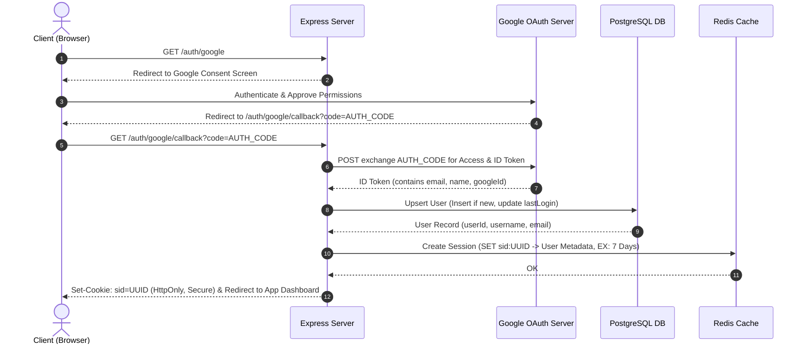

# Google Authentication & Session Management Implementation Guide

This document outlines the architecture, database setup, and step-by-step process to implement secure **Google OAuth 2.0 Authentication** and **Redis-Backed Session Management** in the `checkmate-backend` application.

---

## 🏗️ Architecture Flow



---

## 📋 Prerequisites & Packages

First, install the required NPM packages on the Express server:
```bash
cd express
npm install google-auth-library cookie-parser
npm install --save-dev @types/cookie-parser
```
*   `google-auth-library`: Google's official library to handle token verification.
*   `cookie-parser`: Middleware to parse cookies from incoming requests.

---

## 🛠️ Step 1: Google Cloud Console Configuration

1. Go to the [Google Cloud Console](https://console.cloud.google.com/).
2. Create a new project or select an existing one.
3. Search for **APIs & Services** -> **OAuth Consent Screen**:
   - Choose **External** (unless restricting to an organization).
   - Fill in the required developer email and app name.
   - Under scopes, select `.../auth/userinfo.email` and `.../auth/userinfo.profile`.
4. Go to **Credentials**:
   - Click **Create Credentials** -> **OAuth client ID**.
   - Set Application Type to **Web application**.
   - Under **Authorized JavaScript origins**, add `http://localhost:3000` (and client application hosts).
   - Under **Authorized redirect URIs**, add `http://localhost:3000/auth/google/callback`.
5. Copy the generated **Client ID** and **Client Secret**.

Add these to your `express/.env` file:
```env
GOOGLE_CLIENT_ID=your-google-client-id
GOOGLE_CLIENT_SECRET=your-google-client-secret
GOOGLE_REDIRECT_URI=http://localhost:3000/auth/google/callback
FRONTEND_URL=http://localhost:5173  # For post-auth client redirect
```

---

## 💾 Step 2: Database Schema & Helper Update

Ensure your `user_auth` table is defined in PostgreSQL. The current table setup is:
```sql
CREATE TABLE IF NOT EXISTS user_auth (
    userId INT GENERATED ALWAYS AS IDENTITY PRIMARY KEY,
    googleId TEXT UNIQUE NOT NULL,
    email VARCHAR(255) UNIQUE NOT NULL,
    username VARCHAR(50) UNIQUE NOT NULL,
    createdAt TIMESTAMPTZ NOT NULL DEFAULT CURRENT_TIMESTAMP,
    lastLogin TIMESTAMPTZ
);
```

### Create/Update Database Helper
Implement a database helper to upsert users in `shared/db/user_auth.ts`:

```typescript
import pool from './pg.js';

export interface UserAuthRecord {
  userid: number;
  googleid: string;
  email: string;
  username: string;
  createdat: Date;
  lastlogin: Date | null;
}

export async function upsertGoogleUser(
  googleId: string, 
  email: string, 
  displayName: string
): Promise<UserAuthRecord> {
  // Generate a fallback username from email prefix if none exists
  const baseUsername = email.split('@')[0] || 'user';
  
  const query = `
    INSERT INTO user_auth (googleId, email, username, lastLogin)
    VALUES ($1, $2, $3, NOW())
    ON CONFLICT (googleId) 
    DO UPDATE SET 
      lastLogin = NOW(),
      email = EXCLUDED.email -- keep email updated if changed
    RETURNING userId, googleId, email, username, createdAt, lastLogin;
  `;
  
  // Handled username collisions by appending random numbers if inserting new (or simple upsert)
  try {
    const result = await pool.query(query, [googleId, email, baseUsername]);
    return result.rows[0];
  } catch (error: any) {
    // If username collision happens, attempt to generate with random suffix
    if (error.code === '23505') { // Unique violation code
      const uniqueUsername = `${baseUsername}_${Math.floor(1000 + Math.random() * 9000)}`;
      const fallbackQuery = `
        INSERT INTO user_auth (googleId, email, username, lastLogin)
        VALUES ($1, $2, $3, NOW())
        ON CONFLICT (googleId) 
        DO UPDATE SET lastLogin = NOW()
        RETURNING userId, googleId, email, username, createdAt, lastLogin;
      `;
      const result = await pool.query(fallbackQuery, [googleId, email, uniqueUsername]);
      return result.rows[0];
    }
    throw error;
  }
}
```

---

## 🔒 Step 3: Redis Session Service

Create a session utility service in `express/src/services/session.service.ts` to read, write, and delete user sessions inside Redis.

```typescript
import { redis } from "../../../shared/db/redis";
import crypto from "crypto";

export interface SessionData {
  userId: number;
  email: string;
  username: string;
}

const SESSION_TTL = 7 * 24 * 60 * 60; // 7 days in seconds

export class SessionService {
  /** Create a session ID, store user metadata in Redis, and return session ID */
  static async createSession(user: SessionData): Promise<string> {
    const sessionId = crypto.randomUUID();
    const sessionKey = `session:${sessionId}`;
    
    // Store as JSON string or Hash
    await redis.set(sessionKey, JSON.stringify(user), "EX", SESSION_TTL);
    return sessionId;
  }

  /** Retrieve session details from Redis */
  static async getSession(sessionId: string): Promise<SessionData | null> {
    const sessionKey = `session:${sessionId}`;
    const data = await redis.get(sessionKey);
    if (!data) return null;
    return JSON.parse(data) as SessionData;
  }

  /** Revoke session */
  static async destroySession(sessionId: string): Promise<void> {
    const sessionKey = `session:${sessionId}`;
    await redis.del(sessionKey);
  }
}
```

---

## 🛣️ Step 4: Authentication Controller & Routes

Create `express/src/routes/auth.routes.ts` to manage Google redirect and token callback endpoints.

```typescript
import { Router } from "express";
import { OAuth2Client } from "google-auth-library";
import { upsertGoogleUser } from "../../../shared/db/user_auth";
import { SessionService } from "../services/session.service";

const router = Router();

const oAuth2Client = new OAuth2Client(
  process.env.GOOGLE_CLIENT_ID,
  process.env.GOOGLE_CLIENT_SECRET,
  process.env.GOOGLE_REDIRECT_URI
);

// 1. Redirect to Google Consent screen
router.get("/google", (req, res) => {
  const authorizeUrl = oAuth2Client.generateAuthUrl({
    access_type: "offline",
    scope: [
      "https://www.googleapis.com/auth/userinfo.profile",
      "https://www.googleapis.com/auth/userinfo.email"
    ],
    prompt: "consent"
  });
  res.redirect(authorizeUrl);
});

// 2. Google OAuth Callback
router.get("/google/callback", async (req, res) => {
  const code = req.query.code as string;
  if (!code) {
    return res.status(400).json({ error: "Authorization code missing" });
  }

  try {
    // Exchange code for tokens
    const { tokens } = await oAuth2Client.getToken(code);
    oAuth2Client.setCredentials(tokens);

    // Verify ID Token and parse user information
    const ticket = await oAuth2Client.verifyIdToken({
      idToken: tokens.id_token!,
      audience: process.env.GOOGLE_CLIENT_ID
    });
    
    const payload = ticket.getPayload();
    if (!payload || !payload.sub || !payload.email) {
      return res.status(400).json({ error: "Invalid user details from Google" });
    }

    const { sub: googleId, email, name } = payload;

    // Save/Get user details from DB
    const dbUser = await upsertGoogleUser(googleId, email, name || 'User');

    // Create session in Redis
    const sessionId = await SessionService.createSession({
      userId: dbUser.userid,
      email: dbUser.email,
      username: dbUser.username
    });

    // Set cookie on client
    res.cookie("sid", sessionId, {
      httpOnly: true,
      secure: process.env.NODE_ENV === "production",
      sameSite: "lax",
      maxAge: 7 * 24 * 60 * 60 * 1000 // 7 days in milliseconds
    });

    // Redirect to frontend application
    res.redirect(process.env.FRONTEND_URL || "http://localhost:5173");
  } catch (error) {
    console.error("Google Auth Error:", error);
    res.status(500).json({ error: "Authentication failed" });
  }
});

// 3. Logout
router.post("/logout", async (req, res) => {
  const sessionId = req.cookies.sid;
  if (sessionId) {
    await SessionService.destroySession(sessionId);
    res.clearCookie("sid");
  }
  res.json({ ok: true, message: "Logged out successfully" });
});

export default router;
```

---

## 🛡️ Step 5: Authentication Middleware

Create middleware to enforce authorization checks on protected APIs, such as Party creation and joining. Put this in `express/src/middleware/auth.ts`:

```typescript
import { Request, Response, NextFunction } from "express";
import { SessionService, SessionData } from "../services/session.service";

// Extend Express Request object to hold user details
declare global {
  namespace Express {
    interface Request {
      user?: SessionData;
    }
  }
}

export async function requireAuth(req: Request, res: Response, next: NextFunction) {
  const sessionId = req.cookies?.sid;

  if (!sessionId) {
    return res.status(401).json({ error: "Unauthorized: Session cookie missing" });
  }

  try {
    const sessionUser = await SessionService.getSession(sessionId);
    if (!sessionUser) {
      // Session expired or cleared in Redis
      res.clearCookie("sid");
      return res.status(401).json({ error: "Unauthorized: Session invalid or expired" });
    }

    // Bind session info to request context
    req.user = sessionUser;
    next();
  } catch (error) {
    console.error("Session verification error:", error);
    res.status(500).json({ error: "Internal server authentication error" });
  }
}
```

---

## 🚀 Step 6: Server Integration

Finally, wire everything together in `express/src/index.ts`:

```typescript
import express from "express";
import cookieParser from "cookie-parser";
import authRouter from "./routes/auth.routes";
import partyRouter from "./routes/party.routes"; // If implementing party
import { requireAuth } from "./middleware/auth";

const app = express();

app.use(express.json());
app.use(cookieParser()); // Crucial: enables reading session cookie

// Register Auth Routes
app.use("/auth", authRouter);

// Protected Party Routes example
app.use("/parties", requireAuth, partyRouter);

// Example protected endpoint
app.get("/me", requireAuth, (req, res) => {
  res.json({ user: req.user });
});

// ...
```
